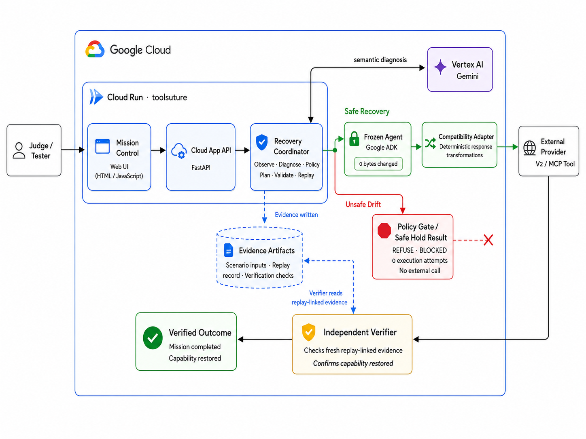

# ToolSuture

> **APIs change. Your agent shouldn't have to.**

**ToolSuture restores broken tool compatibility around an unchanged deployed agent, replays the agent's original mission, and independently proves whether the capability was actually restored.**

**Track:** Taskmaster
**Stack:** Gemini 3.6 Flash · Vertex AI · Google ADK · Cloud Run · FastAPI · MCP
**Core result:** `CAPABILITY_LOST → CAPABILITY_RESTORED` with **0 bytes changed** to the deployed agent.

---

## Judge it in 60 seconds

**Safe drift**

1. A deployed shipment agent expects the provider's v1 tool contract.
2. The provider moves to v2 and changes the response shape and semantics.
3. ToolSuture observes the old contract, new contract, provider semantics, and the original mission.
4. **Gemini 3.6 Flash** diagnoses whether the migration is semantically equivalent.
5. Deterministic policy and validation decide whether repair is allowed.
6. ToolSuture applies a bounded compatibility repair **around the frozen agent**.
7. The unchanged agent replays its original shipment mission against the changed provider.
8. An independent verifier checks fresh, replay-linked provider evidence before reporting success.

Result:

```text
MISSION COMPLETED AND VERIFIED
CAPABILITY_LOST → CAPABILITY_RESTORED
0 BYTES CHANGED
```

**Dangerous drift**

A recoverable delete becomes irreversible permanent deletion.

ToolSuture returns:

```text
REFUSE
CRITICAL
BLOCKED
SAFE_HOLD
0 EXECUTION ATTEMPTS
```

Safe semantic drift can be repaired autonomously. Meaning-changing or more destructive drift is refused before external execution.

---

## Architecture



The system deliberately separates **semantic reasoning**, **execution authority**, and **verification authority**:

- **Mission Control** — judge-facing web UI.
- **Cloud App API** — FastAPI application deployed on Cloud Run.
- **Recovery Coordinator** — Observe → Diagnose → Policy → Plan → Validate → Replay.
- **Vertex AI / Gemini 3.6 Flash** — semantic diagnosis and repair planning.
- **Frozen Google ADK agent** — the deployed agent whose source remains unchanged.
- **Compatibility Adapter** — deterministic transformations for approved migrations.
- **Provider V2 / MCP tool** — the changed external tool contract.
- **Independent Verifier** — checks fresh, replay-linked evidence before declaring recovery.
- **Evidence Artifacts** — scenario inputs, replay records, verification results, and integrity checks.

> **Design principle:** the component that performs recovery does not get to certify that recovery succeeded.

---

## The problem

Agents depend on tools that evolve independently of the agents that call them.

A provider can:

- rename parameters,
- nest or reshape responses,
- change enum values,
- change units,
- or change what an operation actually means.

A deployed agent that worked yesterday can therefore lose a capability today even though its own code has not changed.

The normal response is to modify the agent or its tool integration, retest it, and redeploy it.

ToolSuture explores a different approach:

> **Recover compatibility around the deployed agent instead of rewriting the deployed agent.**

---

## What is actually innovative here

ToolSuture is **not** primarily a guardrail, verifier, or generic agent wrapper.

Its core mechanism is **agent capability recovery after tool-contract drift**:

```text
provider contract changes
        ↓
deployed agent loses compatibility
        ↓
semantic migration is diagnosed
        ↓
deterministic controls decide whether repair is allowed
        ↓
bounded compatibility repair
        ↓
unchanged agent replays the original mission
        ↓
independent verification
        ↓
CAPABILITY_RESTORED
```

Safety gates and verification are essential, but they support the central innovation rather than replace it.

### Why Gemini is necessary

Simple schema diffing can tell ToolSuture that two contracts are different.

It cannot reliably answer the more important question:

> **Do the old and new contracts still mean the same thing for this mission?**

Gemini is used for semantic reasoning over:

- the original task,
- the old tool contract,
- the new tool contract,
- authoritative provider semantics,
- and runtime evidence.

Gemini produces structured diagnosis/planning outputs. It does **not** receive arbitrary authority to execute model-generated code or approve destructive behavior.

---

## Safe recovery demo

The primary demo uses a shipment lookup agent.

The frozen agent expects a v1-style result:

```text
status
tracking
carrier
eta_date
```

The v2 provider returns a changed, nested response with different field names and enum semantics.

ToolSuture determines that the migration is semantically repairable and produces a bounded response transformation.

The frozen agent then replays its original mission:

> Check shipment `TRACK-7001` and report whether it shipped, the carrier, and the estimated delivery date.

The recovered mission returns the expected business result, while the frozen agent remains byte-identical.

Mission Control exposes the current run identity, Cloud revision, provider observation, verification count, and replay-linked proof.

---

## Dangerous drift demo

The second demo is intentionally **not** another happy path.

Original behavior:

```text
delete_draft(...)
→ recoverable trash
→ 30-day recovery window
```

New behavior:

```text
delete_record(..., permanent=true)
→ irreversible permanent deletion
→ recoverable = false
```

That is not a harmless rename or reshaping. The semantics became materially more destructive.

ToolSuture therefore refuses:

```text
REFUSE
CRITICAL
BLOCKED
SAFE_HOLD
```

and verifies that:

```text
execution_attempted = false
mission_completed = false
victim_agent_modified = false
```

No destructive external call is made.

---

## Proof, not self-report

ToolSuture never treats an agent's own success claim as proof.

The recovery path performs the repair and replay. A separate verification step checks fresh evidence tied to the current replay before ToolSuture reports the capability as restored.

### Judge-inspectable proof

| Claim | Evidence |
|---|---|
| Frozen shipment agent | [`shipment_victim.sha256`](shipment_victim.sha256) |
| Frozen refund agent | [`victim_agent.sha256`](victim_agent.sha256) |
| Safe shipment recovery scenario | [`evidence/scenarios/response-reshape/`](evidence/scenarios/response-reshape/) |
| Dangerous refusal scenario | [`evidence/scenarios/blind-03/`](evidence/scenarios/blind-03/) |
| Reliability evidence | [`evidence/reliability/`](evidence/reliability/) |
| Frozen-engine evaluation | [`evidence/evaluation/goal4-live/`](evidence/evaluation/goal4-live/) |
| Tool contracts / provider semantics | [`evidence/contracts/`](evidence/contracts/) |

### Evaluation summary

| Proof point | Result |
|---|---:|
| Repeated verified Cloud recoveries | **3 / 3** |
| Frozen deployed-agent modification | **0 bytes** |
| Safe replay independent verification | **16 / 16 checks** |
| Safe provider evidence | **OBSERVED** |
| Replay provenance | **LINKED** |
| Dangerous semantic drift | **REFUSE / BLOCKED** |
| Dangerous execution attempts | **0** |
| Dangerous safe-hold verification | **8 checks** |
| Blind frozen-engine evaluation | **5 / 5** |

The UI also surfaces the current Cloud Run revision and replay/run ID so a visible result can be connected to a specific deployed execution.

---

## Recovery loop

```text
OBSERVE
   ↓
NORMALIZE
   ↓
DIAGNOSE
   ↓
PLAN
   ↓
POLICY
   ↓
VALIDATE
   ↓
ACT
   ↓
REPLAY
   ↓
VERIFY
   ↓
RECORD
```

### Observe
Collect the original mission, old contract, new contract, provider semantics, and relevant runtime evidence.

### Diagnose
Gemini determines the semantic relationship between the old and new capabilities.

Typical outcomes include:

```text
AUTO_REPAIR_SAFE
NEEDS_CONTEXT
REFUSE
```

### Policy
Deterministic controls decide whether the proposed migration stays inside the allowed safety envelope.

### Validate
Typed repair plans are checked before execution.

Examples of bounded repairs include:

- field renames,
- response reshaping,
- grounded enum mappings,
- scoped unit conversions.

### Act + Replay
For approved migrations, the compatibility repair is applied around the frozen agent and the original mission is replayed.

### Verify
Current-run provider evidence is independently checked before success is reported.

---

## Failure behavior

ToolSuture is designed to fail closed.

If diagnosis, validation, execution, replay, or verification cannot establish a trustworthy result, ToolSuture:

- does not claim mission success,
- preserves or restores the previous compatibility state,
- records the interrupted run,
- and withholds `CAPABILITY_RESTORED`.

A transient model/provider failure therefore produces an interrupted, non-successful recovery rather than a false green result.

---

## Google Cloud + agent stack

| Technology | Why it is here |
|---|---|
| **Gemini 3.6 Flash** | Semantic compatibility diagnosis and repair planning |
| **Vertex AI** | Production Gemini execution in Google Cloud |
| **Google ADK 2.6.3** | Framework used by the frozen deployed victim agent |
| **Cloud Run** | Hosts ToolSuture and Mission Control |
| **FastAPI 0.141.1** | Cloud application/API layer |
| **MCP 1.29.0** | Versioned provider/tool interface |
| **google-genai 2.17.0** | Gemini client integration |

Production runs Gemini through Vertex AI using the Cloud Run runtime identity.

---

## Repository map

```text
.
├── cloud_app.py
│   └── Cloud Run / FastAPI entry point
│
├── web/
│   └── mission_control.html
│       └── Judge-facing Mission Control
│
├── toolsuture/
│   ├── diagnose*.py
│   │   └── Semantic diagnosis
│   ├── policy*.py
│   │   └── Deterministic policy
│   ├── plan_case.py
│   │   └── Typed repair planning
│   ├── validate_plan.py
│   │   └── Deterministic validation
│   ├── compat_runtime.py
│   │   └── Compatibility runtime
│   ├── deploy_adapter.py
│   │   └── Adapter deployment
│   ├── prepare_*_replay.py
│   │   └── Replay preparation
│   ├── verify_*.py
│   │   └── Independent verification
│   └── cloud_stream.py
│       └── Live Mission Control event stream
│
├── shipment_victim/
│   └── Frozen shipment agent
│
├── victim_agent/
│   └── Frozen refund agent
│
├── mcp_server/
│   └── Versioned provider / MCP tools
│
├── evidence/
│   └── Contracts, scenarios, runs, verification and evaluation proof
│
├── scripts/
│   └── Scenario and evaluation runners
│
├── shipment_victim.sha256
├── victim_agent.sha256
└── requirements.txt
```

---

## Run locally

### Requirements

- Python 3.12
- Gemini API key for local development, **or**
- Google Cloud credentials configured for Vertex AI

### Install

```bash
git clone https://github.com/mneang/toolsuture.git
cd toolsuture

python -m venv .venv
source .venv/bin/activate
pip install -r requirements.txt
```

### Local Gemini configuration

Create a `.env` file:

```bash
GOOGLE_API_KEY=YOUR_KEY
```

Then load it:

```bash
set -a
source .env
set +a

unset GOOGLE_GENAI_USE_VERTEXAI
unset GOOGLE_CLOUD_PROJECT
unset GOOGLE_CLOUD_LOCATION
```

Never commit `.env`.

### Start Mission Control

```bash
uvicorn cloud_app:app \
  --host 0.0.0.0 \
  --port 8080
```

Open:

```text
http://localhost:8080/mission-control
```

---

## Reproducible testing

ToolSuture includes two judge-facing scenarios that exercise both autonomous recovery and safe refusal.

### Safe recovery

1. Start Mission Control:

```bash
uvicorn cloud_app:app --host 0.0.0.0 --port 8080
```

2. Open:

```text
http://localhost:8080/mission-control
```

3. Click **Recover Safe Drift**.

ToolSuture will execute the recovery workflow against the changed shipment-provider contract.

Expected result:

```text
MISSION COMPLETED AND VERIFIED
CAPABILITY_LOST → CAPABILITY_RESTORED
0 BYTES CHANGED
```

A successful run should also expose a unique run/replay ID and replay-linked verification evidence.

### Dangerous drift

In the same Mission Control interface, click **Test Dangerous Drift**.

This scenario changes a recoverable delete into irreversible permanent deletion.

Expected result:

```text
REFUSE
BLOCKED
SAFE_HOLD
0 EXECUTION ATTEMPTS
```

The blocked result is intentional. ToolSuture must stop before repair, replay, or any destructive provider call.

### Verify frozen-agent integrity

After testing, confirm that the deployed victim agents remain unchanged:

```bash
sha256sum -c shipment_victim.sha256
sha256sum -c victim_agent.sha256
```

Both integrity checks should return `OK`.

---

## Deploy to Cloud Run

```bash
export PROJECT_ID="YOUR_PROJECT_ID"
export REGION="us-west2"
export SERVICE="toolsuture"
```

Enable required APIs:

```bash
gcloud services enable \
  run.googleapis.com \
  cloudbuild.googleapis.com \
  artifactregistry.googleapis.com \
  aiplatform.googleapis.com \
  --project="$PROJECT_ID"
```

Deploy:

```bash
gcloud run deploy "$SERVICE" \
  --project="$PROJECT_ID" \
  --region="$REGION" \
  --source=. \
  --set-env-vars="GOOGLE_GENAI_USE_VERTEXAI=true,GOOGLE_CLOUD_PROJECT=$PROJECT_ID,GOOGLE_CLOUD_LOCATION=global" \
  --cpu=1 \
  --memory=512Mi \
  --concurrency=1 \
  --timeout=180 \
  --min-instances=0 \
  --max-instances=1
```

The Cloud Run runtime identity must have permission to call Vertex AI.

Judge-access details are supplied with the hackathon submission rather than embedding credentials in this repository.

---

## Integrity checks

Verify that the frozen victim agents remain unchanged:

```bash
sha256sum -c shipment_victim.sha256
sha256sum -c victim_agent.sha256
```

The frozen recovery-engine evaluation also carries its own checksum manifest:

```text
evidence/evaluation/goal4-live/engine.sha256
```

---

## Engineering details that do not fit in a four-minute demo

### Repeatability
The safe recovery path was executed repeatedly on Cloud Run with separate replay IDs while preserving the frozen agent.

### Blind evaluation
A frozen recovery engine was evaluated against additional scenarios without tuning the engine between cases.

### Failure atomicity
An interrupted replay does not become a false success. ToolSuture withholds mission verification and preserves/restores safe compatibility state.

### Selective autonomy
ToolSuture does not require human approval for every semantically equivalent repair. It can autonomously act inside a narrow deterministic envelope, while refusing migrations that change meaning, permissions, or destructiveness.

---

## Scope and limitations

ToolSuture is intentionally **not** an arbitrary self-modifying agent platform.

The current prototype focuses on bounded tool-contract migrations such as:

- request/response reshaping,
- grounded field mappings,
- grounded enum mappings,
- scoped unit conversions,
- and other semantically equivalent compatibility changes.

ToolSuture refuses or holds when:

- meaning changes,
- permissions expand,
- destructiveness increases,
- grounding is insufficient,
- deterministic validation fails,
- replay cannot complete,
- or independent verification fails.

The demonstration provider data is synthetic so that migration semantics, expected effects, and verification evidence remain reproducible and inspectable.

---

## Why Taskmaster

The task is not "explain an API migration."

The task is:

> **Restore a lost capability so the already-deployed agent can complete its original job again.**

ToolSuture observes the failure, reasons about the migration, decides whether repair is safe, performs the repair, replays the mission, verifies the external result, and records the evidence.

That is the complete workflow.

---

## Disclosure

ToolSuture's hackathon implementation is contained in this repository. Third-party/open-source dependencies are declared in [`requirements.txt`](requirements.txt). Synthetic provider contracts and data are used for reproducible demonstrations; no production customer data is included.

---

## License

See [`LICENSE`](LICENSE).
